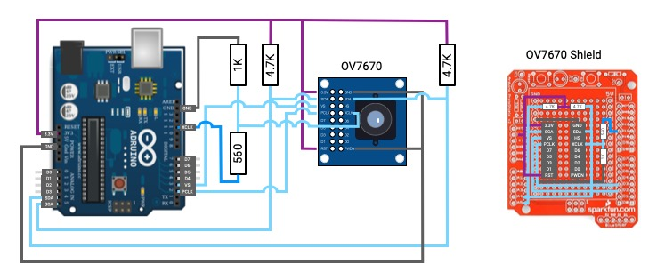

# OV7670
The OV7670 is single chip VGA camera with built-in image processing functions.



## Wiring

The OV7670 module runs off 3.3V supplied by the Arduino.  The camera pixel clock is driven from an 8mhz Arduino interrupt signal on pin 12.  This uses a voltage divider (560K / 1.560K) to drop the voltage from 5V to 3.3V.  

The pixel clock signal is fed back to the Arduino on pin 2 (interrupt 0).  Vertical sync pulses are fed to the Arduino on pin 3 (interrupt 1).

The camera module is configured via I2C (address 0x21).  The Arduino pins A4 (data) & A5 (clock) connect to the corresponding OV7670 SDA and SCA pins. Two 4.7K resistors pull these pins up to 3.3V.

The first 4 pixel data bit signals, D0 to D3, are fed to the Arduino via analog input pins A0 to A3 (PINC & 0x0F). The remaining 4 pixel data bit signals, D4 to D7, are supplied via digital pins D4 to D7 (PIND & 0xF0).


## Caveats

The OV7670 is designed to work at a much higher clock frequency than what can be supplied by the Arduino. The datasheets specifies the minimum input clock frequency to be 10mhz, with the typical being 24mhz. The internal Arduino Uno clock is 16mhz which drives the 8mhz interrupt clock input to the camera module.  So this input clock frequency is already 2mhz below the minimum specification.

Then, some number of Arduino clock cycles are consumed to capture pixel data values for each pixel clock cycle.  As such, a pixel clock of 8mhz is way to fast for this to happen. The pixel clock speed has to be substantially reduced to permit enough time to capture the pixel data, and then transmit these to the host. A clock pre-scaler value can be used to adjust the internal pixel clock rate.  This pre-scaler value adjusts the 8mhz input clock by dividing it by the pre-scaler value plus 1.  This value is stored in bits 5:0 of register 0x11.

I found a pre-scaler value of 0x11 slows the clock enough to allow the majority (explained later) of a quarter-quarter-VGA image to be captured and transmitted back to the host.  At this speed the exposure time for a single frame is just over 3 seconds.  This obviously limits the usefulness of this arrangement for most image capture applications.  It remains to be seen if this is will work for my intended purpose -- estimating the size of pecans in a pecan sorting machine.

## Getting Started

Connect the Arduino to a host computer, start a REPL, and then use the following commands to capture an image.

``` clojure
  (open-board)
  (initialize) ;; this sets the board to qqvga mode and reduces the pixel clock speed
  (cmd :capture-image)
  (close board)

```

You can access the raw, gray-scale, pixel data array using `(:image @accum)`.  The array (130 x 120) is smaller than QQVGA (160 x 120).  This is a trade-off.  30 pixels per row are sacrificed to buy time to transmit pixels from the Arduino back up to the host.  Through trial and error this seemed to be a reasonable compromise between further increasing the exposure time (by slowing the pixel clock) at the expense of capturing less than the full image array.

## Other Settings
The OV7670 module has a large number of parameters that one can adjust to tune image quality.  Many of these, such as exposure control, and gain can be delegated to automated routines within the module, or can be overridden with user specified values.  Following are instructions to read the default values:

``` clojure
(exposure-mode)
(gain-mode)
(brightness-level)
(contrast-level)
(sharpness-level)
(de-noise-mode)
(banding-filter-mode)
```

You can manually override the automatic exposure and gain settings, for example:

``` clojure
(exposure 10)
(gain 5)
```


