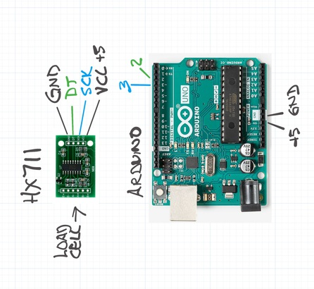

# HX711




## Wiring

The HX711 is a 24bit analog to digital converter.  It's often used to
for Arduino load cell applications.  The HX711 to convert
analog stress guage resistance measurements to digital readings.
These 24 bit readings are fed to the Arduino using the SPI protocol.
Data bits are read over the DT lead on pin 2 of the arduino for each
toggle of the SCK clock lead on pin 3. See also [HX711 Load Cell
Amplifier Interface with
Arduino](https://circuits4you.com/2016/11/25/hx711-arduino-load-cell/).

This is the pinout wiring for the HX711 sketch I'm using:
`../../src/hx711_sketch/hx711_sketch.ino`


Because the Arduino standard Firmata library doesn't have direct
support for SPI, this sketch is a work-around.  It includes the
standard formata library and uses <https://github.com/bogde/HX711> to
read the 24 bit ADC values from the HX711 board.

It uses Firmata to transmit HX711 readings back to the controlling
host. These are sent over a serial usb port encoded as 4-character
Sysex strings.  See also the [Sysex Message
Format](http://firmata.org/wiki/V2.2ProtocolDetails)

## Configuration
This libary looks for a serial port with `usbmodem` in the name. This
appears to be the convention on MacOS. These are the ports on my
MacBook Pro.

``` shell
$ ls /dev/ | grep usb

cu.usbmodem14601
tty.usbmodem14601
```
Try the function  `find-arduino-ports`.

## Usage

Use `start!` to connect to the serial port and begin taking readings,
and `stop!` to quit.

``` clojure
(start!)
(stop!)
```

Use `get-next` to retrieve the most recent stable reading from `scale>` (a
 `core.async` channel). It returns the raw ADC measurement and a calibrated weight.

``` clojure
(get-next) => {:raw 268219035, :weight 25.0 ...}
```

Weights may or may not be valid until the scale is calibrated.

## Calibration
Two variables determine calibrated weights: the tare value,
and the scale factor.  Tare represents the average raw measurement
value for an unloaded scale.  These are typically in the range of
268206500 to 268206600 for my scale.

Scale factor is the amount of calibrated weight change per
corresponding raw value change.  This is typically in the range of 450
to 460 raw units per gram for my scale.

There are two steps to calibrate the scale.  First step is compute a
`tare` value, and then compute the `scaling factor`.

Use `tare!` to zero the scale.  This will adjust the tare to the
average of all readings in `queue`.  The number of readings depends on
the `queue-depth` parameter and the length of time you have been
collecting measurements. Queue-depth is 10 by default.

The scale needs to be unloaded while these 10 measurements are
collected. 

You can also set this value directly, ignoring whatever measurements
may have been collected.

``` clojure
(tare! 268206576)
```

The second step is to compute the scaling factor.

Place a known weight on the scale, wait for the measurement readings
to stabilize, then use `calibrate!` to set the scaling factor. 

Twenty-five grams is the default reference weight.  This happens
to be the weight of the original, small, cube-like, Apple iPhone usb
chargers.  You can override this with whatever reference weight value
you choose.  For example, calibrate using a 10.5 gram weight.

``` clojure
(calibrate! 10.5)
```

## Noise

Raw readings will fluctuate even when the scale is unloaded.  Typically
within a +/- 0.1 gram range.  Some of the variation could potentially
be avoided by using a dedicated regulated 5V power source for the
HX711 board.  But [there are other factors](https://forum.arduino.cc/index.php?topic=365107.0).

New stable weight measurements are pushed to a core-async channel called
`scale>`, which can be read using `get-next`.

Noise detection plays a role in determining what messages to consider
as new values as opposed to random variation. This uses the
`trend-analytics` function to compute several metrics:

* `:bias` sum of the deltas between the last n (queue-depth) readings
* `:mnv`  most negative difference between adjacent reading pairs
* `:mxv`  most postiive difference between adjacent reading pairs
* `:segs` 2 paritioned segments of the last n readings
* `:t0`   average reading value for oldest readings (first segment)
* `:t1`   average reading value for most recent readings
* `:dir`  trendline direction (:stable, :inc, :dec, or :noise)

Trendline direction `:dir` is used to indicate the direction readings
are heading.  The `noise-level` parameter specifies the +/- cutoff
threshold for determining if the most recently recorded values are too
noisy to be trusted.  A threshold value 80 seems to work well in my
experiments.  This value is compared against the most negative and
most positive difference between adjacent pairs of reading.  The
values for these variances are recorded in the `:mnv` and `:mxv`
elements of the analytics map. Readings are classified as `:noise`
when either of these variances fall outside the noise-level threshold.

The trendline direction is determined by comparing the average value
of the most recent half of the reading queue, `:t1` to the average
value of the oldest half `:t0`.  Upward and downward trends are
indicated when the difference between these values falls above or
below the `:noise-threshold` parameter.  Otherwise the measurement is
indicated as stable.

You can inspect these values using `(debug! :analyzer)`; see [Debugging](#debug-anchor).

## Stable Measurements
The `weight-assessor` transducer uses values from `trend-analytics` to
detect new measurements to post to the measurement `scale>` channel.  This is
a sliding buffer of size 1. It holds the last stable reading captured,
and can be read using the `get-next` function.


## Inner Workings

This library uses Nurullah Akkaya's [cloduino
library](https://github.com/nakkaya/clodiuno), a clojure library for
standard firmata.

Connections to a board are made via the `arduino` function passing a
port and a message callback handler.  If successful, it will return an
open serial port.  Otherwise, if it can't find a port with the given
port name, or if that port is already in use by another application,
then this will fail.

This library inserts the function generated by `(msg-handler)` as the
callback handler. It places incoming messages on the
core.async `readings>` channel.

Those readings are processed by transducers via a core.async `pipeline`.

``` clojure
(pipeline 1 scale> xform readings>)
```

### The Transducer Pipeline

``` clojure
(let [xform (comp
             (map decoder)
             (map queuer)
             (map analyzer)
             (map weight-assessor)
             (map (de-dupper 50))
             (filter (fn [{:keys [raw dir]}] (= dir :stable)))
             (map printer)
             (map trimmer))] ...)
```

  * `decoder`  converts sysex strings to integers (the raw readings)
  * `queuer`   pushes raw readings onto a persistent queue
  * `analyzer` applies `trend-analytics` to the `queue`
  * `weight-assessor` waits for stable readings, then converts to weights
  * `de-dupper` drops raw messages that are roughly equivalent (< 50 units)
  * `filter`   filters out all but the stable readings
  * `printer`  prints readings to the REPL
  * `trimmer`  shrinks the message payload by removing some trend-analytics detail
  
  
## Debugging {#debug-anchor}

Use `debug!` to alter what messages get displayed in the REPL.
Pass one or more of the keywords `:queuer` `:de-dupper` `:analyzer`
and/or `:printer`to see more details about these stages of the pipeline.

``` clojure
(debug! :queuer)    ;; see the last n (queue-depth) raw readings
(debug! :analyzer)  ;; trend-analytics
(debug! :de-dupper) ;; values used to decide which messages to drop
(debug! :printer)   ;; stable readings at end of pipeline

(debug! :printer :queuer) ;; see multiple stages
(debug!) ;; turn off debugging messages

```

The `:printer` debugging option is turned on by default.


## Example

See the pecan scale example in `../resources/examples/scale.clj`.

``` clojure
(start!)     ;; open the board, and start reading
(tare!)      ;; set the unloaded scale tare value
(calibrate!) ;; put 25g weight on scale to calibate
(get-next)   ;; see the most recent stable weight

(process!)   ;; do something with the incoming weights
(debug!)     ;; turn off the default printer messages
(stop!)      ;; stop reading, and close the serial port
```


