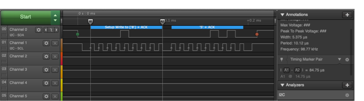

## I2C Firmata Test

For an initial Firmata test, we want to use Clojure on the MacBook to
instruct the Master to send messages to the Slave. In which case the
USB port on the Master will be connected to the MacBook, instead of
the Slave as in Test 1.  For that reason, the Slave's serial port
can't be used to display incoming messages to confirm 1) they were
received, and 2) they were formatted as expected. 

This test uses colored LED's to validate what the Slave is
receiving. The Master sends the pin number of the yellow or green LED
to light them.  The red LED flashes whenever a value is recieved.

## Wiring


Connect pin A5 (clock) and pin A4 (data) on the master Arduino to the
corresponding pins on the slave. 

Connect the Master to the MacBook usb port.

Connect the positive lead of the red, yellow and green LED's to pins
7, 6, and 5 on the Slave.  And connected the negative leads to ground.

## The Code

Run a basic test to validate the setup by loading the following sketch
onto the Master.  It transmits one byte to the slave every 500ms.  The
value of the byte is LED pin to enable.  It alternates between sending
the green and yellow pins.

``` c++
// Wire Master Writer


#include <Wire.h>

int redPin= 7;
int greenPin = 6;
int yellowPin = 5;

void setup()
{
  Wire.begin(); // join i2c bus (address optional for master)
}

byte x = greenPin;

void loop()
{
  Wire.beginTransmission(4); // transmit to device #4
  Wire.write(x);             // sends one byte  
  Wire.endTransmission();    // stop transmitting

  if (x == greenPin ) {
    x = yellowPin;
  }
  else {
    x = greenPin;
  }
  
  delay(500);
}

```

Initialize the Slave to display steady red and yellow LEDs until the
first message is received. Light the yellow if a 5 is received, or the
green if a 6 is recieved.  Flash red whenever a value is received.

``` c++
// Wire Slave Receiver

#include <Wire.h>


int redPin= 7;
int greenPin = 6;
int yellowPin = 5;

void setup() {
  pinMode(redPin, OUTPUT);
  pinMode(greenPin, OUTPUT);
  pinMode(yellowPin, OUTPUT);

  digitalWrite(redPin, HIGH); 
  digitalWrite(greenPin, LOW);
  digitalWrite(yellowPin, HIGH);  
  
  Wire.begin(4);                // join i2c bus with address #4
  Wire.onReceive(receiveEvent); // register event
}

void loop()
{
  delay(100);
}

void receiveEvent(int howMany)
{
  int x = Wire.read();    // receive byte as an integer

  for (int i = 0; i <= 10; i++) {
    analogWrite(redPin, HIGH);
    delay(500);
    analogWrite(redPin, LOW);
    delay(500);    
  }
  
  if (x == greenPin ) {
    digitalWrite(redPin, LOW); 
    digitalWrite(greenPin, HIGH);
    digitalWrite(yellowPin, LOW);  
  } 
  else if (x == yellowPin ) {
    digitalWrite(redPin, LOW); 
    digitalWrite(greenPin, LOW);
    digitalWrite(yellowPin, HIGH);  
  }
  else {
    digitalWrite(redPin, HIGH); 
    digitalWrite(greenPin, LOW);
    digitalWrite(yellowPin, LOW);  
  }
    for (int i = 0; i <= 10; i++) {
    digitalWrite(redPin, HIGH);
    delay(500);
    digitalWrite(redPin, LOW);
    delay(500);    
  }
}
```
## The Test

1. Connect USB to Slave and upload the slave sketch
2. Move USB connection to Master and upload master

You should see alternating yellow and green flashes with a
corresponding red flash with each new message.

# Firmata Test

Replace the Master sketch with StandardFirmata.  This sketch can be
found under File > Examples > Firmata > StandardFirmata.

Open the board from the REPL and initialize the I2C mode.

``` clojure
(use 'clj-arduino.core)
(use 'clodiuno.core)
(use 'clodiuno.firmata)

(def board (arduino :firmata (arduino-port)))
(i2c-init board)
```

Then use `i2c-write` commands to instruct the Master to send a byte to
the Slave.  Close the board when you're done.

``` clojure
 (i2c-write board 4 [0x05]) ;; turn on yellow LED
 (i2c-write board 4 [0x06]) ;; green 
 (i2c-write board 4 [0x07]) ;; any other number should flash red

 (close board)
```

## I2C Messages



This is the logical analyzer output captured for a single 2 byte message sent from the master to the slave.  Each I2C byte is 9 bits long. 8bits of data followed by 9th acknowledgement flag bit.  

The I2C address for the slave 0x04.  It's transmitted using 7-bit
addressing mode, where the slave address is the first 7 bits of the
byte, followed by a one bit read/write flag (0 for read, 1 for write).
Thus, 0x08 is an instruction for Slave to write (receive) the
following data.

The next byte is the data payload, it's the value 0x05 or 0b00000101.
