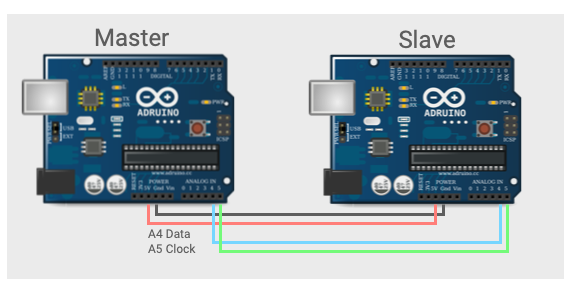

## I2C Wiring



Connect pin A5 (clock) and pin A4 (data) on the master Arduino to the
corresponding pins on the slave. 

The master can, optionally, be powered from the slave.  In either case
they need to share a common ground.

Connect the slave to the MacBook usb port.

## The Code

Transmit a character string containing an ever increasing integer value.

``` c++
// Wire Master Writer


#include <Wire.h>

void setup()
{
  Wire.begin(); // join i2c bus (address optional for master)
}

byte x = 0;

void loop()
{
  Wire.beginTransmission(4); // transmit to device #4
  Wire.write("x is ");        // sends five bytes
  Wire.write(x);              // sends one byte  
  Wire.endTransmission();    // stop transmitting

  x++;
  delay(500);
}

```

This is the slave receiver.  It should be printing the "x is [some
value]" string to the serial port.

``` c++
// Wire Slave Receiver

#include <Wire.h>

void setup()
{
  Wire.begin(4);                // join i2c bus with address #4
  Wire.onReceive(receiveEvent); // register event
  Serial.begin(9600);           // start serial for output
}

void loop()
{
  delay(100);
}

void receiveEvent(int howMany)
{
  while(1 < Wire.available()) // loop through all but the last
  {
    char c = Wire.read(); // receive byte as a character
    Serial.print(c);         // print the character
  }
  int x = Wire.read();    // receive byte as an integer
  Serial.println(x);         // print the integer
}
```
## The Test

1. Connect USB to Master and upload the master sketch
2. Move USB connection to Slave and upload slave
3. Open the Serial Monitor at 9600 baud

You should see the transmission.


