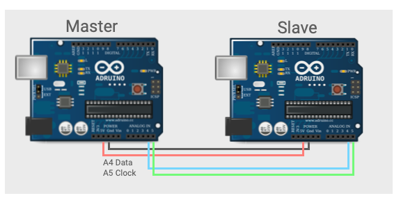

## I2C Wiring



Connect pin A5 (clock) and pin A4 (data) on the master Arduino to the
corresponding pins on the slave. 

The master can, optionally, be powered from the slave.  In either case
they need to share a common ground.

Connect the slave to the MacBook usb port.

## The Master

Transmit a character string containing an ever increasing integer value.

``` c++
// Wire Master Writer


#include <Wire.h>

void setup()
{
  Wire.begin(); // join i2c bus (address optional for master)
}

byte x = 0;

void loop()
{
  Wire.beginTransmission(4); // transmit to device #4
  Wire.write("x is ");        // sends five bytes
  Wire.write(x);              // sends one byte  
  Wire.endTransmission();    // stop transmitting

  x++;
  delay(500);
}

```
## The Slave
We want to use standard firmata i2c functions to read the transmitted
strings. After uploading the Master sketch to the Master Arduino, swap
the USB cable, and upload Standard Firmata to the Slave Arduino.

Standard Firmata is under File > Examples > Firmata > StandardFirmata.


